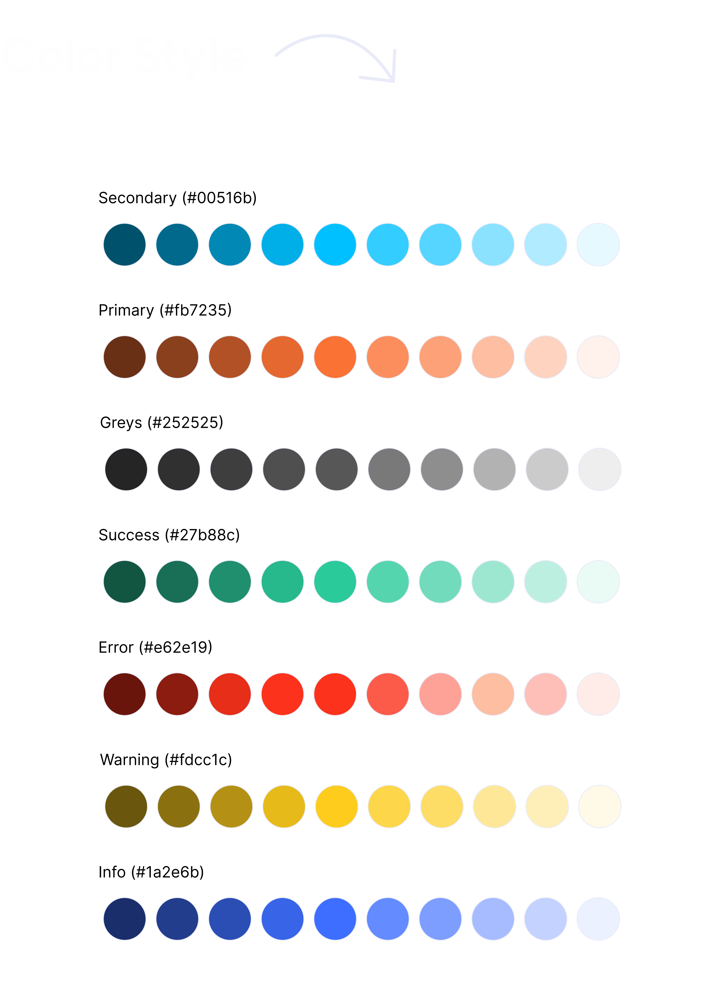
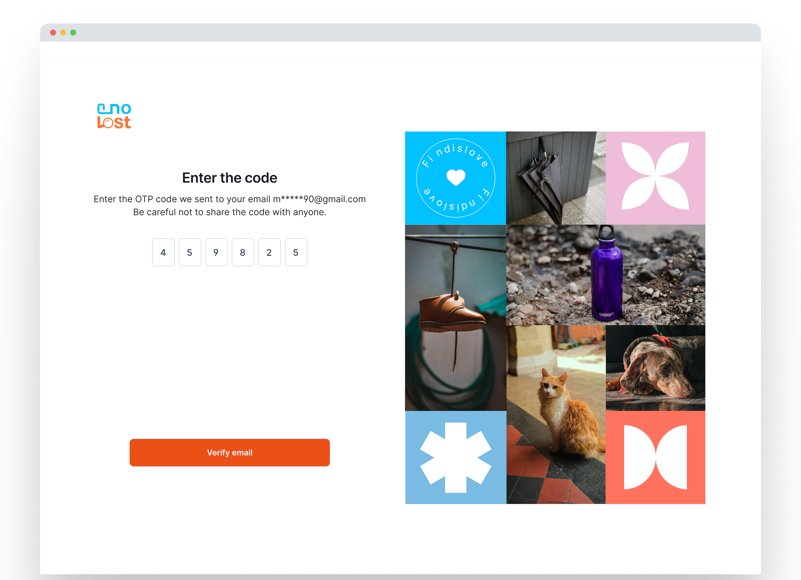
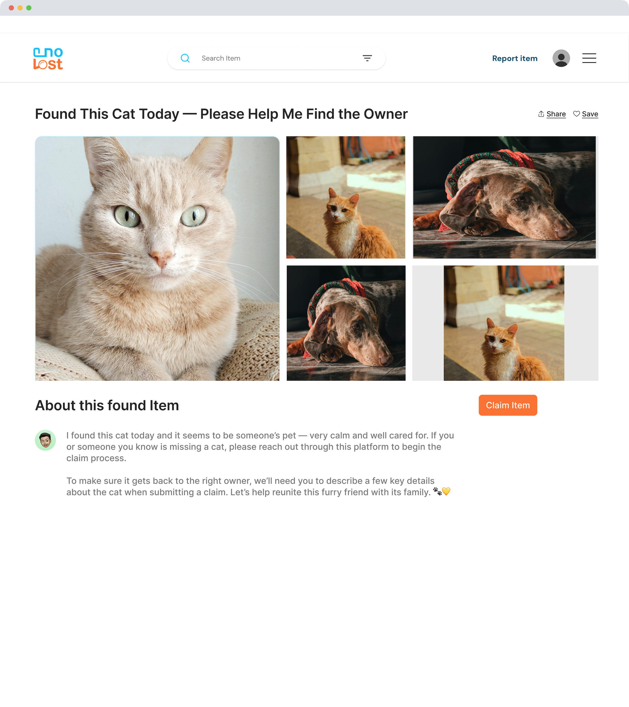

# E no Lost

Description: Lost and Found Web Design
Tags: Style guide, UX design, User Interface, Web design
Tools used: Fig Jam, Figma, Google Forms, Google Sheets

## Project Overview

E No Lost is a web based application designed to simplify and streamline the process of managing lost and found items. It bridges the gap between individuals who have lost valuable possessions and those who find them, creating a centralized platform for quick and efficient resolutions. The application is targeted at places where misplaced items are common.

## Problem Statement

Losing personal belongings is a frustrating and stressful experience. Current solutions for managing lost and found items, such as physical notices, social media posts, or local inquiries, are often inefficient, time consuming, and lack a centralized system for protecting and tracking the lost items.

## Challenges

1. Maximize visibility for lost and found items.
2. Simplify lost and found processes in one place.
3. Quickly reconnect items with their owners.
4. Securely verify rightful ownership.

## Solution

E No Lost makes it easy to report lost or found items, add photos and details, and search a large database. Its matching tools quickly connect people with their belongings.

## Research Phase🔍

To understand user needs and competitor offerings, I began with research.

## Research 👉🏾 Define 👉🏾 Ideate 👉🏾 Design

## **Quantitative Research**

Conducted a quantitative survey (67 responses) to recruit interview participants and understand lost-and-found behaviors. Findings revealed key pain points and adoption interest, helping validate assumptions and refine the app direction before interviews.

- Most respondents were 18–28, indicating a younger audience.
- Many said items stay lost because owners can’t be identified. 
- 80% would return a found item via lost property or by contacting the owner if details were available.
- Mobile apps were the top choice, supporting a mobile first approach.
- The anonymous lost and found concept was received positively, with a few concerns.
- Users prefer optional donations over subscriptions; willingness to pay ranges from small amounts up to ₦5000 ($6.50).

## Interviews 💬

I conducted user interviews to understand the challenges and emotional impact of losing personal items, and to gather feedback on existing lost and found platforms.

## **Competitive Analysis** ⚖️

I conducted a competitive analysis of three major lost and found platforms to identify gaps and opportunities for innovation.

| Key Findings | iLost & Found | MissingX | BoomerangIT |
| --- | --- | --- | --- |
| User Pain Points (Weaknesses) | Lack of seamless account creation, confusing user flow | Limited authentication options, complex navigation | Poor onboarding experience, unclear sign-up process |
| Strengths | Strong organization integration, insurance features | Robust business partnerships, wide market reach | Innovative reward system, user-centric approach |
| Accessibility Issues | No screen reader support, language barriers | Limited accessibility features, complex UI | Poor screen reader integration, navigation issues |
| Design Opportunities | Improve user authentication, simplify flows | Enhanced accessibility, clearer navigation | Better onboarding, intuitive interface |
|  |  |  |  |

Key UX Insights:

- Competitors lack clear hierarchy and intuitive navigation
- Accessibility is often overlooked
- Authentication and onboarding need improvement
- Opportunity for a more user friendly, accessible solution

These insights shaped our design priorities: accessibility, clear navigation, and streamlined authentication.

## **Define Phase**

## User Persona

Created personas and journey maps to better understand user problems.

## User Journey map

|   Actions   | Research | Onboarding | Report Lost Item | Search for Item | Claim Item |
| --- | --- | --- | --- | --- | --- |
|  |  |  |  |  |  |
| Doing | Searches online for lost item asks people, checks physical notice boards. | 1. Downloads the app | 1. Opens the app, uploads photos. | 1. Use search filters (category, location, keywords) | 1. Contact the poster |
|  |  | 2. Creates an account | 2. Navigates to "Report Lost Item, | 2. Browse listings. | 2. Verify ownership,  |
|  |  | 3. Explores the interface. | 3. Fills out the form |  | 3.  Arrange a meeting, |
|  |  |  | 4. uploads photos of lost item. |  | 4. Retrieve the item. |
|  |  |  |  |  |  |
| Thinking | 1. There has to be a better way to find this   | 1. This looks easy to use | 1. I hope I remember all the details  | 1. Is this really my item?  | 1. How legitimate is this person? |
|  | 2. I hope someone has seen it | 2.  I hope this app actually works | 2.  hope someone finds it   | 2. Where is the finder located? | 2. Where do we meet?  |
|  | 3. Where do I even start? | 3.  Is my information safe? | 3. I should take a good picture | 3. How do I contact the finder? | 3. What if its not my item? |
|  |  |  |  |  |  |
| Touchpoint | Direct Google search, social media, E No lost landing page. | 1. E No lost landing page | 1. Report Lost item screen | 1. Search filters | 1. Verification Screen |
|  |  | 2. Onboarding screen | 2. Image/video upload screen | 2. Item listings | 2.  Phone calls, in-person meeting. |
|  |  | 3. Registration Screen |  | 3. Map | 3. Messaging Screen |
|  |  | 4. Email verification |  |  |  |
|  |  | 5. Welcome screen |  |  |  |
|  |  |  |  |  |  |
| Emotion | Frustration, anxiety, hope, desperation. | Curiosity  , optimism, slight apprehension. | Hopeful , anxiety about forgetting details, relief after submitting. | Hopeful, frustration with search filters, excited (if a match is found), disappointed (if no match),  | Excitement, anticipation, nervousness, relief upon retrieval. |
|  |  |  |  |  |  |
| Opportunity | Finds E No Lost  Website | Provide a clear and seamless onboarding experience, highlighting key features and security measures. | Streamline the reporting process, provide clear instructions and helpful prompts, offer photo upload guidance. | Add a search filter, provide clear item descriptions and photos, add map functionality. | Create secure communication between users, provide seamless verification process, offer safety tips for meetings. |

## **Ideation Phase**

<aside>
💡

The user flow map shows how users move through the app, highlighting key paths and interactions. It clarifies hierarchy and guides intuitive feature organization.

</aside>

*User flow map*

## **Design Phase**

## 🎨 Design System

.png)

.png)

.png)

.png)

## **🔑 Registration / Sign Up Screens**

<aside>
💡

Onboarding should feel like an invitation, not a barrier. I kept registration and email verification lightweight, with clear guidance, minimal fields, and a welcoming first step.

</aside>

      Signup ~ Default State 

     Signup ~ Typing State 

     Signup ~ Error State 

      Verification Screen

## 🤳🏾 Browsing found items

.png)

      Home Screen

      Item Details Screen

> The registration screen is intentionally minimal to reduce friction. It asks only for a username, email, and password, so signing up is quick and less overwhelming for first time users.
> 

> As users start typing, field labels shift and helper texts appear. This makes the experience feel more interactive and reduces errors before submission.
> 

> Mistakes can happen…I made sure the error messages were clear and friendly. Instead of red flags or harsh tones, users get gently guided on what needs fixing.
> 

> The “Sign Up” button remains inactive until all fields are valid. This gives users a clear signal that they’re not ready yet, without using a harsh popup or alert.
> 

> After submitting their details, users are asked to verify their email. This adds a layer of trust to the platform and helps prevent spam. I kept the message warm and human, letting users know they’re just one step away from joining the community.
> 

> Once logged in, users land on the dashboard where they can scroll through recently posted found items. Each item is shown in a simple card format with a picture, item type, and short headline. This helps users quickly scan for familiar items.
> 

> Clicking an item card opens a details page with images, a short description, and a bold “Claim Item” button. The layout builds trust and makes the next step clear.
> 

## Claim item process

<aside>
💡

To reduce false claims and build trust, I created a four-step claim flow grounded in evidence, context, and verification. Each screen uses clear progress cues, input limits, and supportive microcopy to guide users.

</aside>

.png)

> In this first step, users are asked to provide personal identification details. These help the platform verify the legitimacy of the person making the claim.
> 

> I included official ID submission to reduce spam and build a sense of accountability from the start. Users can choose the ID type, keeping it flexible.
> 

.png)

> In this step, users describe the item they’re trying to claim. Their answers help confirm ownership, especially when they’re compared with the finder’s report.
>  

 > I used open-ended fields so users could give detailed, personal descriptions. In a future iteration, I’d replace some of these with drop-downs to speed up entry and keep the data more consistency.
> 

.png)

> To further verify ownership, I added memory-based security questions—details only the real owner is likely to know.
> 

> This step adds a more human layer to the process. It’s not just about the item itself, but the story around it, and those personal details are harder to fake than a basic description.
> 

.png)

> The user is asked to schedule a convenient pickup date, time, and location.
> 

> By letting users choose a pickup time and place, I reduced the friction in reuniting people with their items. Future versions can integrate maps or location APIs.
> 

## 🔄 Future Learnings & Iterations

- Next, I plan to design mobile screens, add admin–user communication features, and run usability tests to gather deeper insights.
- I also realized I didn’t include a “Report Found Item” screen, which is essential for encouraging community contributions. In a future iteration, I’d create a clear, streamlined flow that lets users submit found items quickly, including options to add item details, upload photos, and choose visibility settings.
- Finally, I’d replace some text fields (such as item type and ID type) with drop-down menus to reduce effort and improve data accuracy.
- Add a verification success screen to close the onboarding loop and reinforce trust.
- Because the claim flow has multiple steps, I’d add brief tooltips and in-context guidance to help users move through each step with confidence. - Document upload can be difficult for some users, so I’d include a “save and continue later” option and allow uploads via mobile camera capture.
- Add reassuring microcopy throughout the claim process to support users during what can be a stressful experience.

## **Takeaways:**

<aside>
While working on E No Lost, I put most of my energy into the “claim item” experience and overlooked an equally important journey: helping someone report a found item. Catching that gap was a turning point. It reminded me that strong UX isn’t just about polishing individual screens; it’s about supporting the full loop from end to end.  
</aside>

<aside>
In the next iteration, I’d build a simple, friendly “Report Found Item” flow that makes it easy for good samaritans to share what they’ve found...adding key details, uploading photos, and choosing visibility. Ultimately, this product is about more than interface decisions; it’s about enabling community members to help each other.
</aside>
